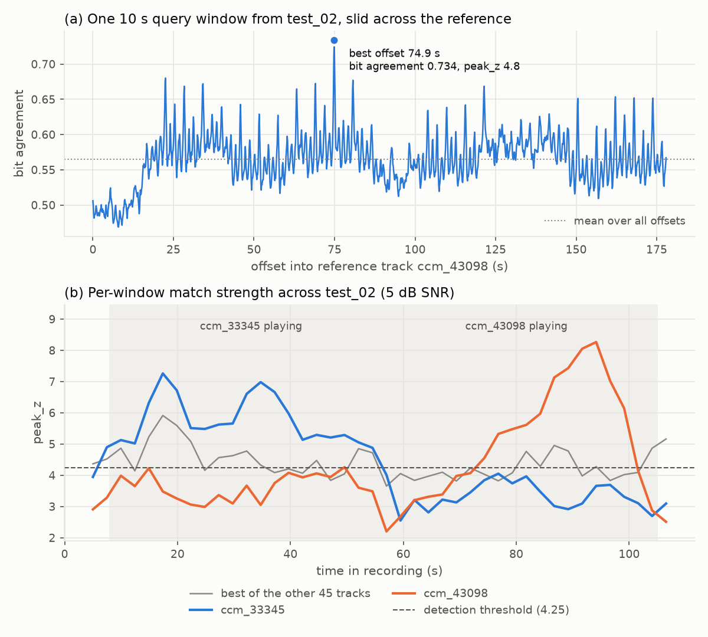

# Music Licensing Analytics

Two tools on one SQL database and one catalog of 47 Creative Commons tracks:

- **Sync licensing scorer.** Describe the track you need (tempo, energy, mood, instrumental) and get
  the catalog ranked by fit, with a one-line reason for each match.
- **Unlicensed use detector.** Give it a recording from a venue. It finds which catalog tracks were
  played using audio fingerprints and a sliding-window matcher written for this project, then checks
  each one against a licenses table and flags any use that isn't covered.

Music licensing businesses (sync agencies, performing-rights organisations, catalog owners) work both
sides of this problem, so the project covers both.

> **Portfolio demo, not a production system.** This is a small, self-built fingerprinting system
> tested only on simulated recordings. It is not legal evidence and can't support an infringement
> claim against any real venue or business. All venues, licensees and licenses are fictional.

## Known limitations

- **Small.** 47 catalog tracks and 14 test recordings.
- **Simulated.** Every venue recording was made by mixing catalog excerpts with real crowd and talking
  noise, reverb, a phone-style filter and MP3 compression. The detector hasn't been tried on a real
  phone recording at a real venue yet.
- **The test set is too small for an accuracy claim.** The held-out set has 6 track appearances and 2
  no-music controls, so getting them all right is a smoke test, not "100% accuracy". The noise stress
  test below is the more useful result.
- **Rule-based tags.** Mood and instrumental tags come from rules applied to the uploaders' own
  ccMixter tags, not from listening or a trained model.

## How the detector works

1. **Fingerprint.** Chromaprint turns audio into about 8 32-bit codes per second. Each bit records
   whether a pitch feature is rising or falling.
2. **Slide.** The recording is cut into 10 s windows. Each window slides across every catalog track,
   and at each position the matcher counts how many bits agree (Hamming distance).
3. **Normalise.** The best position's score is compared with that track's other positions
   (`peak_z`), because some tracks match noise more easily than others.
4. **Confirm.** A track counts as detected only if at least two separate windows agree on the same
   alignment, so one lucky match isn't enough.
5. **License check.** Each detection is looked up in the licenses table by venue and date, and marked
   licensed or flagged (expired, not started yet, or no license on file).



## Results

<!-- RESULTS:START -->

**Detector, simulated recordings** (threshold chosen on the tune set only):

| Set | Tracks found | Missed | False alarms | No-music controls clean |
|---|---|---|---|---|
| Test (held out) | 6/6 | 0 | 0 | 2/2 |
| Tune | 5/6 | 1 | 1 | 1/2 |

**Noise stress test**: the same test excerpts re-mixed at each noise level (SNR = how much louder the music is than the crowd):

| SNR (dB) | 10 | 5 | 0 | -5 | -10 |
|---|---|---|---|---|---|
| Detected | 6/6 | 6/6 | 3/6 | 2/6 | 0/6 |
| False alarms | 0 | 0 | 0 | 0 | 1 |

**Scorer, example brief**: high-energy instrumental for a sports promo:

1. **Spinnin'** (98.8): tempo 103 BPM in 90-120; energy high (RMS 0.314); tags 2/2 (upbeat, driving)
2. **Dollheads** (95.7): tempo 117 BPM in 90-120; energy high (RMS 0.230); tags 2/2 (upbeat, driving)
3. **I Have Often Told You Stories (guitar instrumental)** (79.0): tempo 117 BPM in 90-120; energy high (RMS 0.185); tags 1/2 (driving)

Full tables (per-recording results, threshold sweep, degradation ablation, flag report): [docs/RESULTS.md](docs/RESULTS.md).

<!-- RESULTS:END -->

## Quick start

Needs Python 3.12 plus `fpcalc` (Chromaprint) and `ffmpeg`.

```bash
brew install chromaprint ffmpeg              # Debian/Ubuntu: apt install libchromaprint-tools ffmpeg
python3.12 -m venv .venv
.venv/bin/pip install -r requirements.txt
.venv/bin/streamlit run app.py               # web app: scorer, detector, flag report
```

The database, simulated recordings and 30 s previews are committed, so the app runs on a fresh clone.
To rebuild everything from scratch (downloads ~265 MB of audio, then reruns both modules, the
evaluation and the tests):

```bash
.venv/bin/pip install -r requirements-dev.txt
./run_pipeline.sh
```

Command-line examples:

```bash
.venv/bin/python -m src.scorer --tempo 90-120 --energy high --instrumental --tags upbeat,driving
.venv/bin/python -m src.detector --recording clip.mp3 --venue "Venue A (fictional)" --date 2026-03-14
```

## More detail

- [docs/DETAILS.md](docs/DETAILS.md) covers catalog sourcing and licensing, the database schema, how
  the scorer and detector work, what was and wasn't tested, and findings (for example, two catalog
  tracks match each other because one is a remix of the other).
- [docs/RESULTS.md](docs/RESULTS.md) has every results table, generated from `results/`.
- [notebooks/eda.ipynb](notebooks/eda.ipynb) has feature distributions, tempo checks and fingerprint
  sanity checks.
- [CREDITS.md](CREDITS.md) lists attribution for every track.

**Stack:** Python, SQLite, librosa, Chromaprint/fpcalc, NumPy, pandas, matplotlib, Streamlit, pytest.
