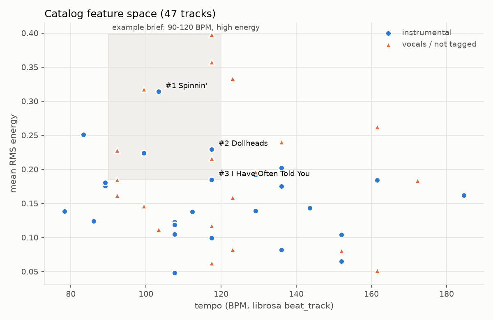

# Results

Everything between the markers below is generated by `python -m src.readme_results` from the JSON
files in `results/`. Nothing in it is typed by hand. Read it alongside the
[known limitations](../README.md#known-limitations): every recording here is simulated, and the test
set is tiny.

<!-- RESULTS:START -->

### Module A: example briefs

From `results/scoring_examples.json` (catalog of 47 tracks; top 3 shown per brief).

**High-energy instrumental for a sports promo (the spec's example CLI brief)** (tempo 90-120; energy high; tags upbeat,driving; instrumental only). 26 tracks pass the filters.

| # | Score | Track | License | Why |
|---|---|---|---|---|
| 1 | 98.81 | Spinnin' (Alex) | cc-by-3.0 | tempo 103 BPM in 90-120; energy high (RMS 0.314); tags 2/2 (upbeat, driving) |
| 2 | 95.72 | Dollheads (Ivan Chew) | cc-by-3.0 | tempo 117 BPM in 90-120; energy high (RMS 0.230); tags 2/2 (upbeat, driving) |
| 3 | 78.95 | I Have Often Told You Stories (guitar instrumental) (Ivan Chew) | cc-by-3.0 | tempo 117 BPM in 90-120; energy high (RMS 0.185); tags 1/2 (driving) |

**Calm, dark-ish instrumental bed under a documentary interview** (tempo 60-100; energy low; brightness low; tags ambient,cinematic; instrumental only). 26 tracks pass the filters.

| # | Score | Track | License | Why |
|---|---|---|---|---|
| 1 | 98.67 | Photo theme: Window like (Antony Raijekov) | cc-by-2.5 | tempo 152 BPM read as 76 (half-time) in 60-100; energy low (RMS 0.065); brightness low (centroid 835 Hz); tags 2/2 (ambient, cinematic) |
| 2 | 83.90 | The Long Goodbye (John Pazdan) | cc-by-2.5 | tempo 152 BPM read as 76 (half-time) in 60-100; energy low (RMS 0.104); brightness low (centroid 965 Hz); tags 1/2 (ambient) |
| 3 | 82.59 | bluenotes (airtone) | cc-by-3.0 | tempo 86 BPM in 60-100; energy low (RMS 0.124); brightness low (centroid 553 Hz); tags 1/2 (cinematic) |

**Funky/jazzy background music for a bar, vocals OK** (tempo 95-115; energy med; tags funky,jazzy). 47 tracks pass the filters.

| # | Score | Track | License | Why |
|---|---|---|---|---|
| 1 | 83.17 | Prelude For Classical Guitar (Instrumental) (Aussens@iter) | cc0 | tempo 112 BPM in 95-115; energy med (RMS 0.138); tags 1/2 (jazzy) |
| 2 | 79.39 | beeKoo mix (Lasswell) | cc-by-3.0 | tempo 92 BPM is 3 BPM below range; energy med (RMS 0.162); tags 1/2 (funky) |
| 3 | 76.30 | Light Me On Fire (Admiral Bob) | cc-by-2.5 | tempo 103 BPM in 95-115; energy low (RMS 0.112), wanted med; tags 1/2 (funky) |

**Acoustic cue for an indie short film (acoustic tag required)** (tempo 80-110; energy med; required tags acoustic). 11 tracks pass the filters.

| # | Score | Track | License | Why |
|---|---|---|---|---|
| 1 | 99.40 | La Madeline Au Truffe (composed by Jeris) (basematic) | cc-by-3.0 | tempo 185 BPM read as 92 (half-time) in 80-110; energy med (RMS 0.162); tags 1/1 (acoustic) |
| 2 | 98.44 | Heart On Redial (loveshadow) | cc-by-3.0 | tempo 92 BPM in 80-110; energy med (RMS 0.185); tags 1/1 (acoustic) |
| 3 | 93.72 | Prelude For Classical Guitar (Instrumental) (Aussens@iter) | cc0 | tempo 112 BPM is 2 BPM above range; energy med (RMS 0.138); tags 1/1 (acoustic) |

### Module B: threshold (tune split only)

Statistic: `peak_z`. Best tune-split F1 = 0.8333 for thresholds 3.9-4.6; chosen threshold = **4.25** (middle of that range). Full sweep: `results/threshold_tuning.json`.

### Module B: detection accuracy

| Split | Recordings | TP | FP | FN | Precision | Recall | Offsets within 1 s | Negative controls with no detection |
|---|---|---|---|---|---|---|---|---|
| test (held out) | 7 | 6 | 0 | 0 | 1.00 | 1.00 | 6/6 | 2/2 |
| tune (threshold chosen here) | 7 | 5 | 1 | 1 | 0.83 | 0.83 | 5/5 | 1/2 |

Per-recording results (`results/detector_evaluation.json`):

| Recording | SNR (dB) | Expected | Detected (bit agreement / peak_z / offset error s) | Missed |
|---|---|---|---|---|
| test_01 | 10 | ccm_30513 | ccm_30513 (0.770 / 5.08 / -0.04) | - |
| test_02 | 5 | ccm_33345, ccm_43098 | ccm_33345 (0.864 / 7.26 / +0.04); ccm_43098 (0.750 / 8.27 / -0.05) | - |
| test_03 | 0 | ccm_2905 | ccm_2905 (0.802 / 8.76 / +0.00) | - |
| test_04 | 5 | ccm_31670 | ccm_31670 (0.692 / 6.95 / +0.00) | - |
| test_05 | 5 | ccm_54335 | ccm_54335 (0.806 / 8.63 / -0.02) | - |
| test_neg_01 | noise only | none | none | - |
| test_neg_02 | 5 | none | none | - |
| tune_01 | 10 | ccm_29630 | ccm_29630 (0.776 / 6.93 / -0.07) | - |
| tune_02 | 5 | ccm_17432 | ccm_17432 (0.782 / 7.41 / -0.01) | - |
| tune_03 | 0 | ccm_26157, ccm_64427 | ccm_64427 (0.678 / 6.55 / +0.03); ccm_26157 (0.714 / 7.58 / +0.12) | - |
| tune_04 | -5 | ccm_58268 | none | ccm_58268 |
| tune_05 | 5 | ccm_4209 | ccm_4209 (0.830 / 5.08 / +0.01) | - |
| tune_neg_01 | noise only | none | ccm_64427 **(false positive)** (0.577 / 4.83) | - |
| tune_neg_02 | 5 | none | none | - |

### Module B: stress test across noise levels

`results/snr_sweep.json`: each of the 6 test-split excerpts re-mixed with crowd + talking noise at each SNR, threshold 4.25.

| SNR (dB) | Detected | False positives |
|---|---|---|
| 10 | 6/6 | 0 |
| 5 | 6/6 | 0 |
| 0 | 3/6 | 0 |
| -5 | 2/6 | 0 |
| -10 | 0/6 | 1 |

### Module B: which degradation hurts most

`results/degradation_ablation.json`: test-split excerpts, non-overlapping 10 s windows, one degradation at a time.

| Condition | Mean best bit agreement | Mean peak_z | Best offset = true offset |
|---|---|---|---|
| clean (lossless) | 0.949 | 7.59 | 91% |
| 64k MP3 only | 0.948 | 7.57 | 91% |
| room reverb only | 0.864 | 6.76 | 91% |
| phone band-limit 100-7000 Hz, order 2 (used) | 0.837 | 6.96 | 91% |
| steeper band-limit 150-7000 Hz, order 4 (first draft, rejected) | 0.745 | 6.06 | 83% |
| crowd+chatter noise at 10 dB SNR | 0.921 | 7.09 | 78% |
| crowd+chatter noise at 5 dB SNR | 0.872 | 6.46 | 78% |
| crowd+chatter noise at 0 dB SNR | 0.776 | 5.44 | 78% |
| crowd+chatter noise at -5 dB SNR | 0.656 | 4.08 | 43% |

### Module B: flag report

`results/detection_report.json`: 12 detections across 14 recordings, 4 licensed, 8 flagged (all venues and licenses fictional).

| Recording | Venue | Date | Track | Licensed | Reason |
|---|---|---|---|---|---|
| Simulated Venue Recording 1 | Venue A (fictional) | 2026-03-14 | The New Music | yes | active license #1 (background music - public performance) covers 2026-03-14 [2026-01-01 to 2026-12-31] |
| Simulated Venue Recording 2 (DJ set) | Venue A (fictional) | 2026-03-21 | Urbana-Metronica (wooh-yeah mix) | **no** | license #2 expired on 2025-12-31 |
| Simulated Venue Recording 2 (DJ set) | Venue A (fictional) | 2026-03-21 | Drive | **no** | license #3 on file with status 'none' |
| Simulated Venue Recording 3 (quiet piano under talking) | Venue B (fictional) | 2026-04-02 | Photo theme: Window like | yes | active license #4 (background music - public performance) covers 2026-04-02 [2026-01-01 to 2026-06-30] |
| Simulated Venue Recording 4 | Venue B (fictional) | 2026-04-10 | Start Again | **no** | license #5 is active but runs 2026-05-01 to 2027-04-30; event was 2026-04-10 |
| Simulated Venue Recording 5 (short excerpt) | Venue C (fictional) | 2026-05-01 | Hanging Eleven | yes | active license #6 (live event - public performance) covers 2026-05-01 [2026-01-01 to 2026-12-31] |
| Tuning Recording 1 | Venue A (fictional) | 2026-02-07 | Straight To The Light | yes | active license #7 (background music - public performance) covers 2026-02-07 [2026-01-01 to 2026-12-31] |
| Tuning Recording 2 | Venue B (fictional) | 2026-02-08 | Silence Await | **no** | no license on file for ccm_17432 at Venue B (fictional) |
| Tuning Recording 3 | Venue C (fictional) | 2026-02-09 | bluenotes | **no** | no license on file for ccm_64427 at Venue C (fictional) |
| Tuning Recording 3 | Venue C (fictional) | 2026-02-09 | Heart On Redial | **no** | no license on file for ccm_26157 at Venue C (fictional) |
| Tuning Recording 5 | Venue C (fictional) | 2026-02-11 | A New System DNB | **no** | no license on file for ccm_4209 at Venue C (fictional) |
| Tuning negative: crowd and talking only | Venue A (fictional) | 2026-02-12 | bluenotes (false positive) | **no** | no license on file for ccm_64427 at Venue A (fictional) |

<!-- RESULTS:END -->

